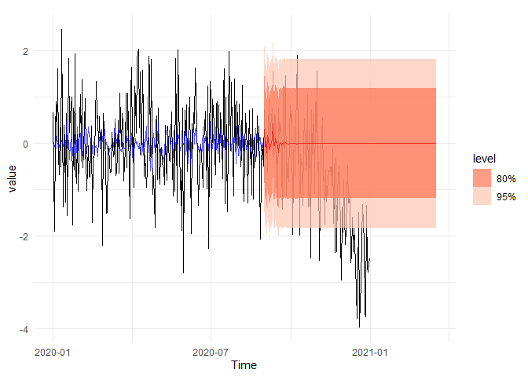
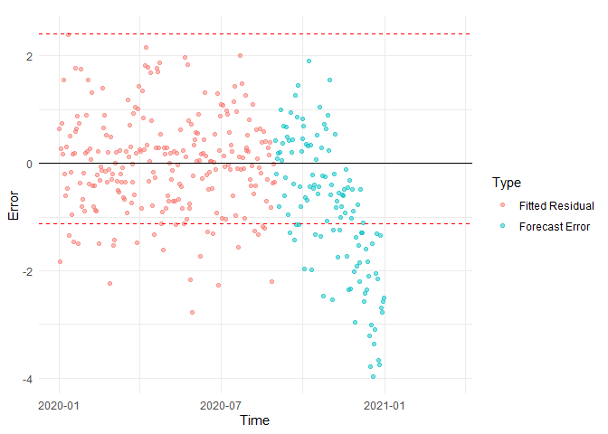

<!-- README.md is generated from README.Rmd. Please edit that file -->

# riceblast 

[](https://www.repostatus.org/#wip)
[](https://www.gnu.org/licenses/old-licenses/gpl-3.0.html)
[](https://cran.r-project.org/)
[](commits/master)

------------------------------------------------------------------------

[](/commits/master)

The goal of the `riceblast` R package is to provide data and tools for
forecasting rice blast disease outbreaks using weather-based parameters.
It combines climate variables (such as temperature, humidity, and
rainfall) with knowledge of disease development to build predictive
models and early warning systems. The package helps researchers,
agronomists, and policymakers understand and anticipate disease risks,
supporting sustainable management strategies to reduce crop losses and
improve food security.

## Installation

You can install the development version of riceblast from
[GitHub](https://github.com/pridiltal/riceblast) with:

``` r
# install.packages("pak")
pak::pak("pridiltal/riceblast")
```

## Proposed framework

The following figure summarizes the proposed framework for climate-based
blast disease monitoring, comprising two primary phases: an off-line
phase and an on-line phase. In the off-line phase, historical climate
data characterizing typical behaviour are preprocessed, and an automated
model selection procedure is employed to identify the optimal univariate
model for a given dataset, which are subsequently fitted to the data.
Residuals from these models are then analyzed to estimate field-specific
anomalous thresholds using Extreme Value Theory (EVT), providing
reference points for the detection of potential disease outbreaks. In
the on-line phase, incoming climate data from the test window undergoes
preprocessing and forecast generation. Forecast errors are evaluated
against the previously determined anomalous thresholds to classify
observations as either typical or indicative of a blast alert. This
two-phase approach enables both data-driven model calibration and
real-time disease risk assessment.


## Example

This is an example dataset available in the riceblast package. For more
examples, please refer to the package vignettes.

``` r
library(riceblast)
head(field1)
#> # A tibble: 6 × 9
#>   time                  d2m   t2m  stl1   u10     v10         tp type       RH
#>   <dttm>              <dbl> <dbl> <dbl> <dbl>   <dbl>      <dbl> <chr>   <dbl>
#> 1 2020-11-01 01:00:00  298.  298.  299.  1.72  0.487  0          typical  95.8
#> 2 2020-11-01 02:00:00  297.  300.  301.  1.98  0.332  0.00000102 typical  84.5
#> 3 2020-11-01 03:00:00  297.  302.  303.  2.29  0.200  0.00000248 typical  73.2
#> 4 2020-11-01 04:00:00  296.  303.  305.  2.33  0.0884 0.00000291 typical  65.3
#> 5 2020-11-01 05:00:00  295.  304.  307.  2.43 -0.457  0.00000291 typical  56.4
#> 6 2020-11-01 06:00:00  294.  305.  309.  2.47 -1.22   0.00000291 typical  51.4
```

The following example demonstrates the detection of unusually low values
(lower extremes) in a daily time series, using a synthetic dataset
processed through the `riceblast` workflow. We first fit a model on an
initial “typical” period to estimate the lower extreme threshold and
then test whether future observations fall below that threshold. The
generated plots visualize both the detected extremes and the
corresponding forecast errors.

``` r
# Create a sample daily time series dataset 
data <- tsibble::tsibble(
  date = seq.Date(as.Date("2020-01-01"), as.Date("2020-12-31"), by = "day"),
  value = c(rnorm(300), rnorm(66, -3)),
  index = date
)


# Fit the model to estimate the lower extreme threshold using a “typical” period
result <- model_extremes_uni(
  full_data = data,
  time_col = date,
  typical_start = "2020-01-01",
  typical_end = "2020-08-30",
  response = value,
  thr_prob_fit = 0.1,
  t_method = "boxplot"
)
#> # A tsibble: 243 x 2 [1D]
#>    date         value
#>    <date>       <dbl>
#>  1 2020-01-01 -0.111 
#>  2 2020-01-02 -1.08  
#>  3 2020-01-03 -0.190 
#>  4 2020-01-04 -0.752 
#>  5 2020-01-05 -0.468 
#>  6 2020-01-06 -0.104 
#>  7 2020-01-07 -0.452 
#>  8 2020-01-08 -0.0192
#>  9 2020-01-09 -1.07  
#> 10 2020-01-10  0.727 
#> # ℹ 233 more rows

# Prepare a test dataset
test_data <- data |>
  dplyr::filter(date > as.Date("2020-06-30")) |>
  dplyr::select(date, value) |>
  tsibble::as_tsibble(index = date)

# Evaluate future values against the learned extreme threshold
test_result <- riceblast::test_extremes_uni(result, test_data = test_data, h = 200)

# # Generate and view plots for extremes and errors
plots <- plot_extreme_analysis_uni(test_result)
#> Plot variable not specified, automatically selected `.vars = .fitted`

# Visualize future forecasts relative to the typical historical behaviour
plots$main_plot
```



``` r

# Visualize detected extremes using the residual and forecast error plots
plots$error_plot
#> Warning: Removed 77 rows containing missing values or values outside the scale range
#> (`geom_point()`).
```



## Funding

This R package was developed under the interdisciplinary project titled
“Weather-based Blast Disease Forecasting and Early Warning Systems for
Climate Risk Adaptation”, funded through the National Agricultural
Research Plan (NARP) initiative of the Sri Lanka Council for
Agricultural Research Policy (SLCARP) -2024.

## Project team members

Chandima Ariyarathna, Department of Botany, University of Peradeniya

Priyanga Dilini Talagala, Department of Computational Mathematics,
University of Moratuwa

Sachith P. Abesundara, Department of Statistics and Computer Science,
University of Peradeniya

Mahlon Pragath Rambukkange, Department of Geography, University of
Peradeniya

K.R.D. Gunapala, Rice Reaserch and Development Institute, Batalagoda

H.N.S. Fernando, Rice Reaserch and Development Institute, Batalagoda
