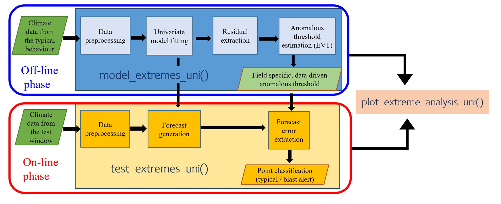

```{r, include = FALSE}
knitr::opts_chunk$set(
  collapse = TRUE,
  comment = "#>",
  message = FALSE,
  warning = FALSE
)
```

```{r setup}
library(riceblast)
library(ceylon)
library(tidyverse)
library(sf)
library(fable)
library(feasts)
library(tsibble)
library(evd)
library(lubridate)
library(rlang)
```

This vignette presents a step-by-step univariate weather-based framework for detecting rice blast disease using historical climate records and blast observations from Field 1 in Kilinochchi, Sri Lanka (9.385680° N, 80.538083° E). 


## Visualize data

```{r field1, fig.height=12}
# assuming your data frame is named df
# Gather all continuous variables into long format
df_long <- field1 |>
  pivot_longer(
    cols = c(d2m, t2m, stl1, u10, v10, tp, RH),
    names_to = "variable",
    values_to = "value"
  )

# Create the plot
ggplot(df_long, aes(x = time, y = value, color = type)) +
  geom_point(alpha = 0.6) +
  geom_vline(aes(xintercept = as.POSIXct("2021-02-12 00:00:00", tz = "UTC")),
             color = "red", linetype = "dashed") +
  geom_vline(aes(xintercept = as.POSIXct("2021-02-12 00:00:00", tz = "UTC") -
                   (14 * 24 * 60 * 60)), color = "blue", linetype = "dashed") +
  geom_vline(aes(xintercept = as.POSIXct("2020-11-15 00:00:00", tz = "UTC")),
             color = "darkgreen", linetype = "dashed") +
  facet_wrap(~variable, scales = "free_y", ncol = 1) +
  theme_minimal() +
  labs(
    title = "Meteorological Variables Over Time",
    x = "Time",
    y = "Value",
    color = "Type"
  ) +
  theme(
    strip.text = element_text(face = "bold"),
    plot.title = element_text(hjust = 0.5),
    legend.position = "bottom"
  )
```

In the figure above, the three vertical dotted lines (from left to right) denote the planting date (dark green), the start of the two-week period preceding the disease point (blue), and the disease point itself (red). The variables d2m (dew point temperature at 2 m), t2m (air temperature at 2 m), stl1 (top-layer soil temperature), and relative humidity all show a noticeable decline as the disease point approaches. In contrast, the other weather variables do not exhibit a marked change in their patterns near the disease point.


For the typical model-building process, we consider the two-and-a-half-month period following the planting date as the *plant’s typical behaviour window*. Previous observations indicate that disease symptoms do not appear during this period. Within this window, both t2m and stl1 remain relatively stable, making it an ideal baseline for modelling typical behaviour. After the typical model is fitted, it is used to forecast future values. If the observed data later deviates substantially from these forecasted values outside the typical behaviour window, such deviations are interpreted as potential signals of blast disease occurrence.

### Air temperature 2 meters above ground

```{r}
# Create the plot of Air temperature 2 meters above ground.
field1 |>
  ggplot(aes(x = time, y = t2m)) +
  geom_line() +
  geom_point(alpha = 0.6) +
  geom_vline(aes(xintercept = as.POSIXct("2021-02-12 00:00:00", tz = "UTC")),
             color = "red", linetype = "dashed") +
  geom_vline(aes(xintercept = as.POSIXct("2021-02-12 00:00:00", tz = "UTC") -
                   (14 * 24 * 60 * 60)), color = "blue", linetype = "dashed") +
  geom_vline(aes(xintercept = as.POSIXct("2020-11-15 00:00:00", tz = "UTC")), 
             color = "darkgreen", linetype = "dashed") +
  theme_minimal() +
  labs(
    title = "Air temperature 2 meters above ground",
    x = "Time",
    y = "Value",
    color = "Type"
  ) +
  theme(
    strip.text = element_text(face = "bold"),
    plot.title = element_text(hjust = 0.5),
    legend.position = "bottom"
  )
```

###  Temperature of the top soil layer.

```{r}
# Create the plot of Air temperature 2 meters above ground.
field1 |>
  ggplot(aes(x = time, y = stl1)) +
  geom_line() +
  geom_point(alpha = 0.6) +
  geom_vline(aes(xintercept = as.POSIXct("2021-02-12 00:00:00", tz = "UTC")), 
             color = "red", linetype = "dashed") +
  geom_vline(aes(xintercept = as.POSIXct("2021-02-12 00:00:00", tz = "UTC") -
                   (14 * 24 * 60 * 60)), color = "blue", linetype = "dashed") +
  geom_vline(aes(xintercept = as.POSIXct("2020-11-15 00:00:00", tz = "UTC")),
             color = "darkgreen", linetype = "dashed") +
  theme_minimal() +
  labs(
    title = "Soil temperature level 1",
    x = "Time",
    y = "Value",
    color = "Type"
  ) +
  theme(
    strip.text = element_text(face = "bold"),
    plot.title = element_text(hjust = 0.5),
    legend.position = "bottom"
  )
```

Both stl1 (soil temperature level 1) and t2m (air temperature 2 meters above ground) exhibit similar patterns in the data. According to field experts, air temperature measurements are relatively more cost-effective than soil temperature measurements. Therefore, for the model-building process, we prioritise the use of air temperature. 

### Modelling the typical behaviour


In the following code, we define the typical window as the two-and-a-half-month period following the planting date.

```{r}
typical_f1  <- field1 |>
  filter(
    time >= as.POSIXct("2020-11-15 00:00:00", tz = "UTC"),
    time <= as.POSIXct("2020-11-15 00:00:00", tz = "UTC") + months(2) + days(15)
  ) |>
  select(time, t2m) |>
  tsibble::as_tsibble(index = time)
  
typical_f1 |> autoplot(t2m) 
```

The following code produces the autocorrelation and partial autocorrelation plots for air temperature (t2m) within the typical window. These plots help identify temporal dependencies in the data, which is useful for selecting appropriate time series models and understanding the underlying patterns.

```{r}
typical_f1 |> 
  ggtime::gg_tsdisplay(t2m, plot_type='partial')
```


Since the data is recorded hourly, a 24-hour seasonal pattern is observed. The following code applies a 24-hour differencing to the air temperature (t2m), which helps make the series stationary with a constant mean, constant variance, and a more random pattern. It then visualizes the autocorrelation and partial autocorrelation of the differenced series:


```{r}
 typical_f1 |>
  mutate(diff = difference(t2m, 24)) |>
  ggtime::gg_tsdisplay(diff, plot_type = 'partial')
```

The univariate `riceblast` framework first builds a model for the plant’s typical behaviour and then forecasts the expected future values for the test-phase window. The following code defines the test window for potential blast detection:

```{r}
test_f1 <- field1 |>
  dplyr::filter( time > as.POSIXct("2021-01-30 00:00:00", tz = "UTC") ) |>
      dplyr::select(time, t2m) |>
      tsibble::as_tsibble(index = time)
```


As illustrated in the figure below, the riceblast package operationalizes the univariate analysis framework through three key functions.

```{r diagram, echo=FALSE, fig.align="center", out.width="100%"}

```

First, the typical behaviour is modelled and the lower extreme threshold is computed from the observed data using the `model_extremes_uni()` function. Next, future values are forecasted and compared against the test-phase data to identify potential blast events using the `test_extremes_uni()` function. Finally, the results, including thresholds and detected extremes, are visualized to facilitate interpretation and analysis using the `plot_extreme_analysis_uni()` function.

The following code performs EVT-based threshold calculation to detect potential blast disease events. In the `riceblast` framework, the user can adjust the EVT-derived lower extreme threshold using a safety margin multiplier ($k$) to account for the inherent uncertainty in tail data modeling. EVT focuses on modeling the tail of the distribution, where data is sparse, which can lead to overfitting and underestimation of variability. Applying a safety margin, such as $k = 1.5$, widens the threshold, thereby reducing the risk of false positives by incorporating this uncertainty. This approach aligns with established practices in EVT applications, where threshold adjustments help mitigate the effects of estimation errors in extreme value predictions. Setting $k = 0$ returns the original EVT-derived threshold without any modification.

```{r eval = FALSE}

# Step 1: Fit model and compute lower extreme threshold
analysis_result <- riceblast::model_extremes_uni(
  typical_data  = typical_f1,
  time_col = time,
  response = t2m,
  t_method = "evd",
  k=1.5
)

# Step 2: Forecast + test against full data
test_result <- riceblast::test_extremes_uni(analysis_result, test_data = test_f1, h = 1000)

# Step 3: Visualize everything
plots <- plot_extreme_analysis_uni(test_result)
```

```{r echo = FALSE, eval = FALSE}
saveRDS(analysis_result, here::here("inst","extdata", "analysis_example_evd.rds"))
saveRDS(test_result, here::here("inst","extdata","test_result_example_evd.rds"))
saveRDS(plots, here::here("inst","extdata", "plots_example_evd.rds"))
```

```{r echo=FALSE}
analysis_result <- readRDS(system.file("extdata", "analysis_example_evd.rds", package = "riceblast"))
test_result <- readRDS(system.file("extdata", "test_result_example_evd.rds", package = "riceblast"))
plots <- readRDS(system.file("extdata", "plots_example_evd.rds", package = "riceblast"))
```

The following plot (`main_plot`) is a `ggplot`2 object displaying the observed, fitted, and forecasted series during both the offline phase and the online phase of the analysis.

```{r}
plots$main_plot

```

The following plot is a `ggplot2` object showing residuals and forecast errors along with the threshold. The vertical dotted line represents the disease point, while the horizontal dotted line indicates the EVT-based threshold, adjusted using a safety margin.

```{r}
p<- plots$error_plot +
    geom_vline(aes(xintercept = as.POSIXct("2021-02-12 00:00:00", tz = "UTC")),
             color = "red", linetype = "dashed")

print(p)
```


The following code enables an interactive visualization of the plot above using `plotly`, allowing for closer investigation around the disease point:

```{r}
plotly::ggplotly(p)
```

For comparative purposes, a threshold calculation using the boxplot “outlier whiskers” method is also available in the package for detecting anomalous values. The user can choose their preferred method, either EVT-based or boxplot-based threshold calculation by specifying the `t_method` argument in the `model_extremes_uni()` function.


```{r eval=FALSE }

# Step 1: Fit model and compute lower extreme threshold
analysis_result <- riceblast::model_extremes_uni(
  typical_data  = typical_f1,
  time_col = time,
  response = t2m,
  t_method = "boxplot"
)

# Step 2: Forecast + test against full data
test_result <- riceblast::test_extremes_uni(analysis_result, test_data = test_f1, h = 1000)

# Step 3: Visualize everything
plots <- plot_extreme_analysis_uni(test_result)
```


```{r echo = FALSE, eval = FALSE}
saveRDS(analysis_result, here::here("inst","extdata", "analysis_example_boxplot.rds"))
saveRDS(test_result, here::here("inst","extdata","test_result_example_boxplot.rds"))
saveRDS(plots, here::here("inst","extdata", "plots_example_boxplot.rds"))
```

```{r echo=FALSE}
analysis_result <- readRDS(system.file("extdata", "analysis_example_boxplot.rds", package = "riceblast"))
test_result <- readRDS(system.file("extdata", "test_result_example_boxplot.rds", package = "riceblast"))
plots <- readRDS(system.file("extdata", "plots_example_boxplot.rds", package = "riceblast"))
```


```{r}
plots$main_plot

```


```{r}
plots$error_plot
```


```{r}
analysis_result$lower_limit

```


